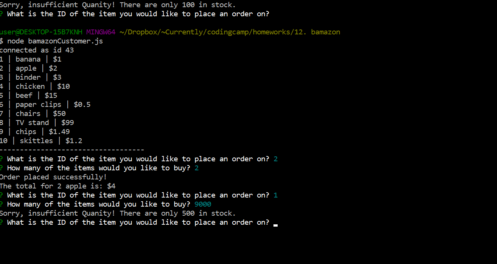

# bamazon
week 12

Run the bamazonCustomer.js file with node

You will see a list of inventory available

It will prompt to ask you which item you would like to purchase, enter the item ID accordingly as shown below.

It will then proceed to ask you how many of the items you would like to purchase, enter any random integers.

The program will check if there are enough inventory in the stock with the quantity requested.

If there are, an message will show that order has been placed successfully, with the calculation of total cost.

If there are not enough inventory, the program will show the current inventory amount with notification that order has not been processed and prompt to restart the ordering process.

